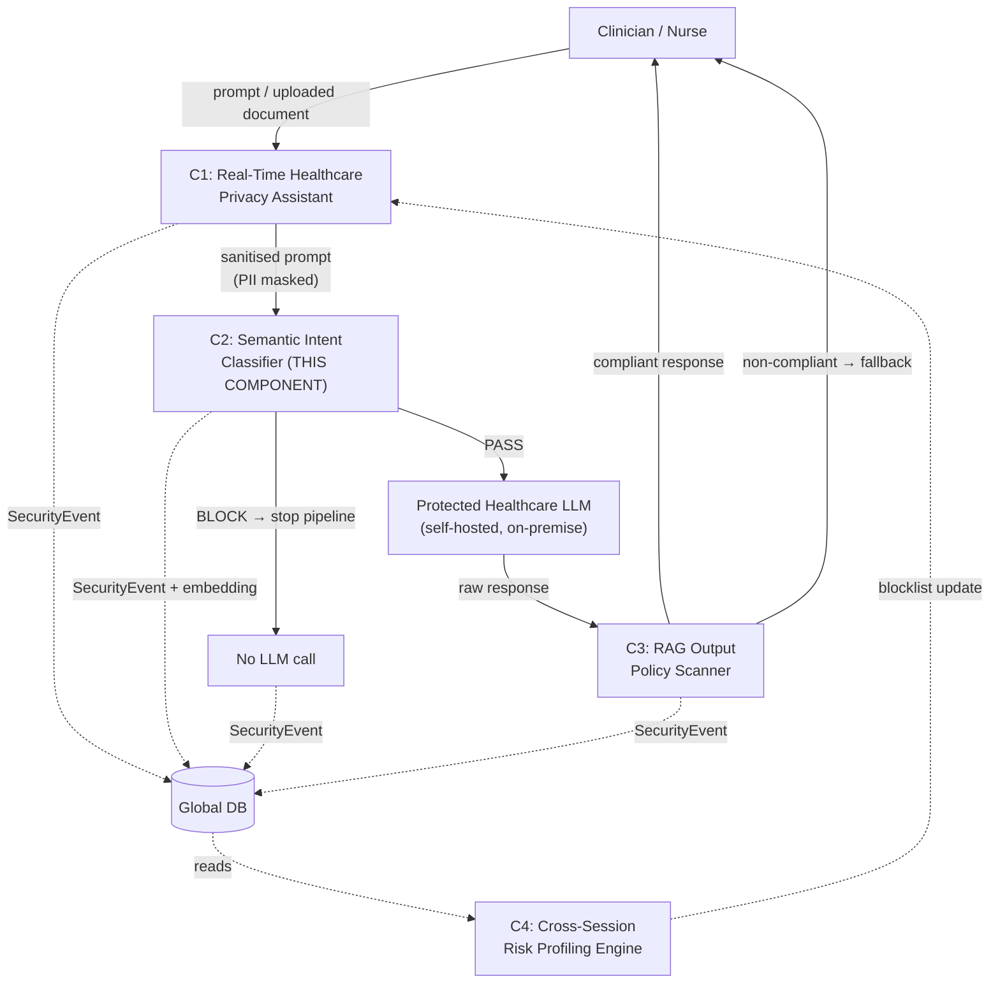
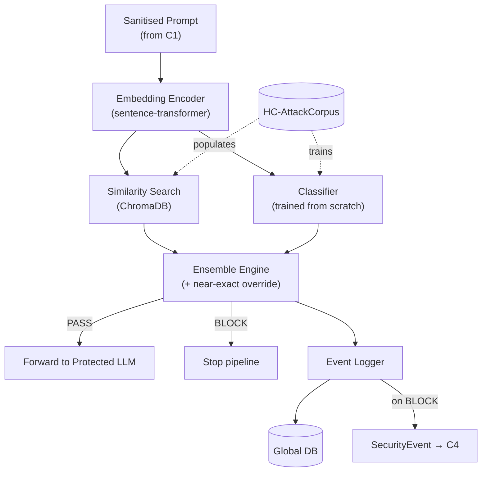
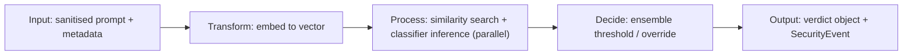
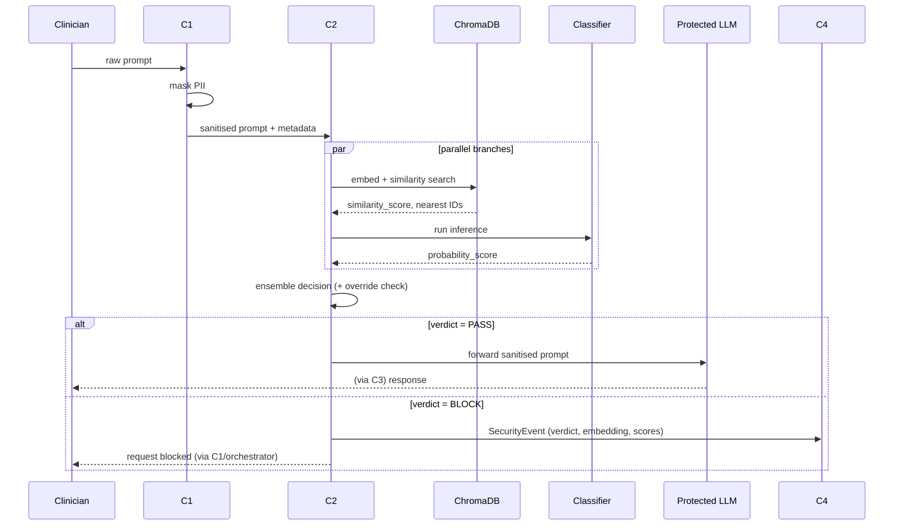
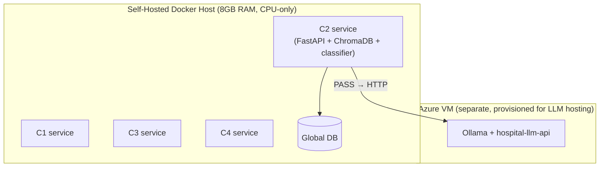
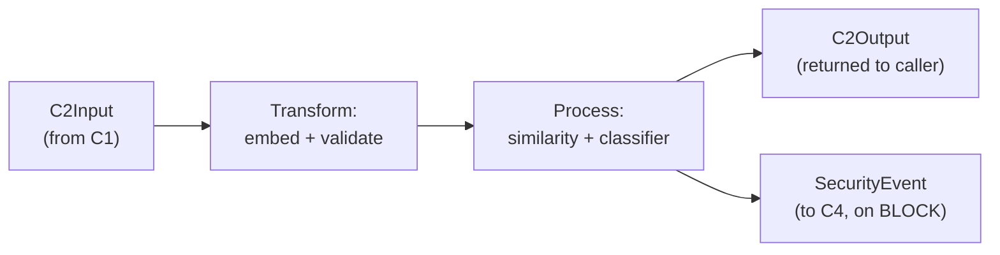
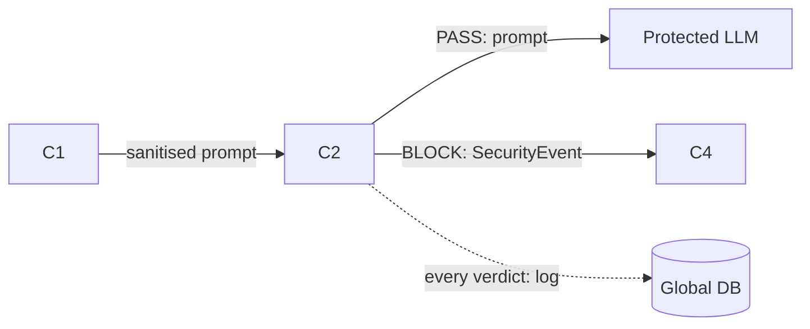

# C2 — Semantic Intent Classifier
## Complete Technical Reference Document

**Project:** J26-CS-321 — A Multi-Layer Security Middleware Framework for Protecting Healthcare LLM Applications
**Component:** C2 — Semantic Intent Classifier
**Owner:** N.T. Lokuvithana (IT23262904), B.Sc. (Hons) IT, Cyber Security
**Supervisors:** Mr. Kavinga Yapa (Supervisor), Ms. Helani Herath (Co-Supervisor)
**Source of truth:** `IT23262904.pdf` (final proposal draft) + project design discussions

---

> **How to read this document.** Every substantive claim below is tagged:
> - **[Proposal §X]** — stated explicitly in the final proposal document, section X
> - **[UI Prototype]** — confirmed from the team's shared `MediGuardAI` frontend codebase (not the proposal document, but real shared code, so treated as a hard constraint, not a guess)
> - **[Assumption]** — reasonable inference where neither the proposal nor the prototype specifies something
> - **[Recommendation]** — an implementation decision I'm proposing, not yet binding
> - **[Needs Confirmation]** — must be settled with supervisor/team before implementation proceeds
> - **[Proposal Defect]** — something currently *wrong* in the proposal draft that should not be treated as a requirement until fixed
>
> Where the proposal is silent, this document says so explicitly rather than inventing a requirement and attributing it to the proposal.

---

## 1. Overall Research Project Context

**Research title [Proposal, title page]:** *A Multi-Layer Security Middleware Framework for Protecting Healthcare LLM Applications* (Project ID J26-CS-321).

**Research problem [Proposal §1.1]:** LLM assistants are increasingly used by hospital staff to draft clinical notes, discharge summaries, and referrals, with patient context pasted directly into prompts. This creates two distinct risk surfaces: (1) the prompt may leak explicit patient identifiers or be crafted to manipulate the system regardless of what identifiers remain, and (2) even a fully safe prompt can produce a response that violates hospital policy. A further risk — repeated or evolving attack attempts by the same user across sessions — is invisible to any single-request check.

**Background & motivation [Proposal §1.1]:** Prompt injection has ranked as the **#1 risk in OWASP's Top 10 for LLM Applications for two consecutive editions** — this is the proposal's cited statistical evidence, not an invented figure. Existing guardrails fall short for hospital deployment specifically because: cloud-based guardrails (Azure Prompt Shields, AWS Bedrock Guardrails) require sending patient data to a third-party vendor; open guard models (Llama Guard 3, ShieldGemma) are GPU-heavy and trained on generic, non-clinical harm taxonomies; and no reviewed system measures how much protection a given layer adds over another.

**Existing gap [Proposal §1.3]:** No existing open or reproducible system combines CPU-only self-hosted operation, a healthcare-specific labelled attack corpus, and a measured detection-value-added over an upstream sanitisation layer.

**Proposed solution [Proposal, overall architecture]:** A four-layer, CPU-only, self-hostable middleware sitting between the clinician and a protected healthcare LLM:

| # | Component | Owner | Role |
|---|---|---|---|
| C1 | Real-Time Healthcare Privacy Assistant | Linuka (D.L.A. Wijewickrama) | Auth, PHI/inference-risk detection, reversible masking |
| **C2** | **Semantic Intent Classifier** | **N.T. Lokuvithana (you)** | **Screens the masked prompt for disguised attack intent** |
| C3 | RAG Output Policy Scanner | Yasas (Y.N. Maddumage) | Checks the LLM's response against live hospital policy |
| C4 | Heuristic Cross-Session Risk Profiling Engine | Sandul (S.D.W. Gunaratne) | Aggregates security events into a per-user behavioural risk score |

**Main objective [Proposal §2.1, project-wide]:** Build and evaluate a layered defence pipeline that is self-hostable, CPU-only, and whose combined, measured contribution (via a layered-defence ablation) exceeds what any single layer achieves alone.

**Overall data/information flow [Proposal §4, confirmed diagram — Figure 1 in the proposal]:**



### Where C2 fits

- **Why it exists [Proposal §1.1]:** C1's masking only removes *identifiers*. An attacker can phrase a request so that no raw identifier remains while the malicious intent — record extraction, clinician impersonation, jailbreaking — still survives. Nothing upstream of C2 catches this.
- **Problem it solves [Proposal §1.3, §2.1]:** Detects attack intent in already-sanitised prompts, and quantifies how much detection value this adds over C1 alone (the project's central research question for this component).
- **Depends on:** C1 (sole upstream input).
- **Depended on by:** the protected LLM (receives C2's PASS traffic only) and C4 (consumes every C2 verdict + embedding as a SecurityEvent).
- **Receives:** a sanitised prompt object from C1.
- **Produces:** a PASS/BLOCK verdict with confidence, plus a structured SecurityEvent for C4.
- **Contribution to research objective:** C2 is one of the four pillars of the layered-defence ablation — the project's measurable claim is that each layer stops something the previous layer didn't; C2's share of that claim is attacks that survive C1's masking.

---

## 2. My Component Overview

| Field | Value |
|---|---|
| Component number | C2 |
| Component name | Semantic Intent Classifier |
| **Purpose [Proposal §1 Abstract]** | Detect residual, paraphrased/obfuscated attack intent in already-PII-masked prompts, using a CPU-only similarity+classifier ensemble |
| **Scope** | Input-side, post-C1, pre-LLM only |
| **Main problem solved [Proposal §1.3]** | No existing CPU-only, healthcare-specific detector measures value added over a sanitisation layer |

**Responsibilities [Proposal §4 Individual Responsibility Boundary — Confirmed]:**
- HC-AttackCorpus construction and labelling — **mine**
- Similarity-search pipeline (embeddings + ChromaDB) — **mine**
- Classifier training and threshold calibration — **mine**
- Verdict object / SecurityEvent schema — **shared** with the team
- Sanitised-prompt input format — **shared**, defined jointly with C1's owner

**Expected functionality [Proposal §5 FR1–FR9]:** ingest sanitised prompt → embed → similarity-match → classify → ensemble verdict → structured logging/event emission. (Full detail in §4 and §8 below.)

**Inputs [Proposal, data model + UI Prototype]:** sanitised prompt text + `user_id`, `session_id`, `request_id`, `c1_metadata`, `timestamp` from C1.

**Outputs [Proposal, data model + UI Prototype]:** a verdict object (`request_id`, PASS/BLOCK, confidence, method, nearest-attack evidence, embedding, latency, model version) and, on BLOCK, a SecurityEvent to C4. The `request_id` field exists specifically because the team's shared frontend (`Clinical.tsx`) already renders a blocked message keyed off a `requestId` — see §9.

**Dependencies:** C1 (input format), shared JSON contracts (frozen at a team milestone), ChromaDB, a trained classifier checkpoint, the protected LLM (as C2's downstream call target on PASS).

**Constraints [Proposal NFR6, NFR1]:** CPU-only, Docker, 8GB RAM machine; p95 latency target ≈80ms.

**Assumptions:**
- **[Assumption]** The "protected LLM" referred to generically in the proposal is the Ollama-hosted model already provisioned on the team's Azure VM (built during project infrastructure setup, not described in the proposal document itself).
- **[Assumption]** "Global DB" in the proposal's architecture diagram is a shared datastore owned operationally by C4; C2 only ever writes to it, never reads from it.

### In Scope
- Embedding generation for sanitised prompts
- Similarity search against a healthcare-specific attack-vector store
- A classifier trained from scratch on HC-AttackCorpus
- Ensemble combination logic (including the near-exact-match override)
- Verdict API exposing the decision
- Structured event emission to C4
- HC-AttackCorpus construction, cleaning, and the four frozen evaluation sets

### Out of Scope
- PII/PHI detection or masking (**C1**)
- Blocklist/regex matching on raw text (**C1**)
- Output-side policy/compliance checking (**C3**)
- Cross-session behavioural scoring or blocklist enforcement (**C4**)
- Generating the clinical answer itself (**the protected LLM**)
- OCR / document-upload scanning (**C1**)

---

## 3. Component Objectives

### Primary Objective **[Proposal §2.1 — verbatim]**
> "To design a CPU-only semantic intent classifier (C2) that combines similarity search and a trained classification model to detect and block malicious prompts before they reach the protected LLM, and to quantify the detection value this adds over Component C1's sanitisation layer alone."

- **What it means:** build a working ensemble detector, and treat the *marginal* value over C1 — not standalone accuracy — as the headline result.
- **Why required:** this is the component's entire reason for existing within the gap statement.
- **How achieved:** §4 architecture + §9 evaluation design.
- **How measured:** recall on the C1-residual test set vs. a "C1-only" baseline (layered-defence ablation).

### Secondary Objectives **[Proposal §2.2 — Confirmed]**
1. Construct HC-AttackCorpus from CARES-18K + deepset/prompt-injections, correcting the discovered train/test leakage.
2. Build the similarity-search pipeline (embeddings + ChromaDB).
3. Train a compact classifier from scratch.
4. Combine both signals into a calibrated threshold-based verdict.
5. Evaluate recall/FPR/latency on four frozen test sets, with statistical comparison (McNemar's test) across configurations.
6. Integrate with C1/C3/C4 via shared contracts, emitting SecurityEvents for C4's cross-session tracking.

### Technical Objectives **[Derived from Proposal FR/NFR — Recommendation for grouping, content Confirmed]**
- Keep end-to-end added latency within the CPU real-time budget (NFR1).
- Ensure the system degrades safely, never silently passing an unclassified prompt (NFR2, NFR7).
- Keep the component fully offline/self-hosted with no external model API calls (FR9).

---

## 4. Requirements

### Functional Requirements **[Proposal §5 — Confirmed, verbatim intent]**

| ID | Requirement | Source | Priority | Implementation Consideration |
|---|---|---|---|---|
| FR1 | Accept a sanitised prompt + `user_id`/`session_id`/`c1_metadata` from C1 | Proposal | Must | Define the exact JSON schema jointly with C1's owner before Week 8 |
| FR2 | Convert every sanitised prompt into a fixed-length embedding | Proposal | Must | Pin the embedding model version in every log record (see §9) |
| FR3 | Compare the embedding against a ChromaDB store of known attack embeddings, return top-k + scores | Proposal | Must | k is not specified in the proposal — **[Needs Confirmation]**, recommend k=5 as a starting point |
| FR4 | Run a from-scratch-trained classifier for an independent attack probability | Proposal | Must | Final architecture undecided — **[Needs Confirmation]**, see §13 |
| FR5 | Combine similarity + classifier scores into PASS/BLOCK via a calibrated threshold, with a near-exact-match override | Proposal | Must | Thresholds are placeholders pending ROC calibration — **[Needs Confirmation]** |
| FR6 | Expose a verdict API (decision, confidence, method, nearest attack IDs) | Proposal | Must | Exact endpoint path/verb not specified — **[Recommendation]**: `POST /classify` |
| FR7 | Emit a SecurityEvent to C4 on every BLOCK, including the embedding | Proposal | Must | Schema must be frozen jointly with C4's owner |
| FR8 | Provide a threshold-calibration/benchmark mode (ROC curve on validation split) | Proposal | Should | Offline tooling, not part of the live service |
| FR9 | No call to any hosted third-party model API in the judgement path | Proposal | Must | Verify the classifier's inference library makes zero outbound calls at runtime |

### Non-Functional Requirements **[Proposal §5 — Confirmed]**

| ID | Requirement | Area | Target | Source |
|---|---|---|---|---|
| NFR1 | Added latency per prompt | Performance | p95 ≈ 80ms, CPU-only | Proposal |
| NFR2 | Default to a safe verdict if ChromaDB/classifier is unavailable | Reliability | No silent pass-through | Proposal |
| NFR3 | Never log raw PHI; only transmit the embedding (not raw text) to C4 | Privacy | — | Proposal |
| NFR4 | Threshold/weights/classifier version externally configurable | Maintainability | No retrain required to adjust | Proposal |
| NFR5 | Every module independently unit-testable | Testability | — | Proposal |
| NFR6 | CPU-only, Docker, single 8GB RAM machine | Portability | — | Proposal |
| NFR7 | Every request gets a verdict; no unhandled failure silently forwards | Reliability | — | Proposal |
| NFR8 | New labelled attack examples addable to the vector store incrementally | Scalability | No full rebuild | Proposal |

**Not included (irrelevant to C2):** multi-tenant authentication/authorisation, UI accessibility requirements, payment/billing — none appear in the proposal for this component and none are reasonable to invent.

---

## 5. Component Architecture

> The architecture below is **[Proposal, Figure 2 — Confirmed]** at the structural level (two branches → ensemble → verdict), with implementation-level technology choices marked as **[Recommendation]** where the proposal names a category but not a specific library/version.

### 5.1 Major Modules

| Module | Purpose | Input | Output | Recommended Tech | Why |
|---|---|---|---|---|---|
| **Embedding Encoder** | Shared vectorisation step | Sanitised prompt (str) | 384-dim vector | `sentence-transformers`, `all-MiniLM-L6-v2` **[Recommendation]** | Small (~90MB), fast on CPU, well-validated for semantic similarity |
| **Attack Vector Store** | Similarity search against known attacks | Embedding | top-k (id, score) | ChromaDB (embedded) **[Proposal]** | Named explicitly in the proposal; no separate DB server needed |
| **Classifier Service** | Independent attack-probability prediction | Sanitised prompt (tokenised) | P(attack) ∈ [0,1] | HF Transformers, architecture TBD **[Needs Confirmation]** | See §13 |
| **Ensemble Engine** | Combine both scores into a verdict | similarity_score, probability_score | verdict, confidence, method | Pure Python logic, no external dependency | Deterministic, auditable, cheap |
| **Verdict API** | External interface | HTTP request | JSON verdict object | FastAPI **[Proposal, tech stack]** | Already the team's shared framework choice (also used for the Protected LLM wrapper) |
| **Event Logger** | Writes to Global DB, emits SecurityEvent to C4 | verdict object | DB write + event | **[Assumption]** MongoDB client, matching C4's storage choice — **[Needs Confirmation with C4's owner]** | — |
| **Corpus Builder** (offline) | Builds/maintains HC-AttackCorpus | Raw source datasets | Cleaned, split, labelled corpus | `pandas`, `scikit-learn` (group splitting) **[Recommendation]** | Standard tooling, no new dependency |

### 5.2 Security Controls
- Input is always already-masked text from a trusted upstream component — **[Assumption]** C2 does not re-validate C1's masking, it trusts the contract.
- No raw PHI is ever persisted by C2 (NFR3).
- Classifier and vector store run fully offline (FR9) — no risk of prompt data leaving the host via an external API call.

### 5.3 Logging/Monitoring
- Every verdict (PASS or BLOCK) is logged with latency and model version for auditability — **[Proposal, NFR regarding auditability is implied but not explicitly numbered]** — **[Recommendation]** add structured logging (JSON lines) in addition to the Global DB write, for local debugging during development.

---

## 6. Architecture Diagrams

### Overall Research Architecture
*(see §1 — not repeated here)*

### My Component Architecture



### Data Flow (Input → Processing → Decision → Output)



### Sequence Diagram — End-to-End Request



### Deployment Architecture


**[Assumption]** The proposal doesn't specify whether all four components run on one machine or separate ones; NFR6 says "a single 8GB RAM machine," which this diagram follows. The LLM itself is drawn separately since it was provisioned independently during project setup, outside the proposal's described scope.

---

## 7. Detailed Module Breakdown

| Module | Purpose | Inputs | Outputs | Dependencies | Error Handling | Testing Focus |
|---|---|---|---|---|---|---|
| Embedding Encoder | Vectorise text | Prompt string | 384-dim float vector | sentence-transformers model file | Catch tokenisation errors on malformed/empty input; return a defined error verdict, not a crash | Unit: known inputs → expected vector shape/determinism |
| Attack Vector Store | Nearest-neighbour lookup | Embedding | top-k (id, distance) | Pre-populated ChromaDB collection | If collection unavailable, fail safe (NFR2) — see §25 | Unit: known embedding → known top-1 match |
| Classifier Service | Attack probability | Tokenised prompt | Float [0,1] | Trained checkpoint file | If checkpoint fails to load, fail safe, log critical error | Unit: labelled examples → expected class direction |
| Ensemble Engine | Final verdict | Two scores | verdict, confidence, method | None (pure logic) | N/A — deterministic function | Unit: exhaustive threshold boundary cases (see §12) |
| Verdict API | External interface | HTTP POST body | JSON response | FastAPI, all above modules | Input validation (missing fields → 422); internal errors → 500 with no data leakage in the error body | Integration: full request/response cycle |
| Event Logger | Persistence + event emission | Verdict object | DB write, SecurityEvent | Global DB client | Retry-with-backoff on transient DB failure; never block the verdict response waiting on logging | Integration: simulate DB outage |

---

## 8. End-to-End Workflow

1. **Input received** — C2's API receives a sanitised prompt + metadata from C1 (FR1).
2. **Input validated** — required fields present (`prompt`, `user_id`, `session_id`); malformed requests rejected with a clear error, not silently processed.
3. **Embedding generated** — the prompt is encoded once (FR2); this vector is reused by both branches.
4. **Parallel processing** (not sequential — see rationale in §12):
   a. Similarity search against ChromaDB (FR3)
   b. Classifier inference (FR4)
5. **Ensemble decision** — near-exact-match override checked first; otherwise weighted combination against the calibrated threshold (FR5).
6. **Verdict generated** — PASS or BLOCK, with confidence and method.
7. **Action taken** — PASS: prompt is forwarded to the protected LLM. BLOCK: pipeline stops, no LLM call is made.
8. **Event logged** — every verdict is written to the Global DB; a SecurityEvent (including the embedding) is additionally emitted to C4 on BLOCK (FR7). **[Assumption]** — the proposal's architecture diagram shows all three input-side components writing continuously to the Global DB, which this document reads as "log every verdict, not just BLOCKs"; only the C4-facing *SecurityEvent* is BLOCK-only per FR7's wording.
9. **Response returned** — the verdict object is returned synchronously to the caller (C1/orchestrator) within the latency budget (NFR1).

---

## 9. Data Flow and Data Structures

### Input: C2Input **[Proposal data model — Confirmed structure; `request_id` added per UI Prototype, see below]**
```python
class C2Input:
    prompt: str          # sanitised text — PII already masked by C1
    user_id: str         # logging only, not used in classification
    session_id: str
    request_id: str      # [UI Prototype] propagated from pipeline entry — see note below
    c1_metadata: dict    # what C1 found/masked, for context/logging
    timestamp: datetime
```
- **Validation [Recommendation]:** `prompt` non-empty, reasonable max length (e.g. 8,000 chars) to bound embedding/classifier latency.
- **Security requirement [Proposal NFR3]:** must already be PII-free; C2 does not re-scan for PHI.

### Output: C2Output **[`request_id` field added per UI Prototype — see note below]**
```python
class C2Output:
    request_id: str               # echoed back unchanged — lets the UI correlate this verdict
                                   # to the specific chat message awaiting a response
    verdict: str                  # "PASS" or "BLOCK"
    confidence: float              # 0.0–1.0
    method: str                    # "similarity_override" | "ensemble"
    nearest_attack_ids: list[str]
    nearest_scores: list[float]
    prompt_embedding: list[float]  # 384 numbers — logged for C4
    latency_ms: int
    model_version: str             # pinned so C4 never mixes embedding-model versions
```

> **[UI Prototype — confirmed finding]** The team's shared `MediGuardAI` frontend (`src/views/Clinical.tsx`) already defines the client-side contract for how a BLOCK surfaces to the clinician:
> ```tsx
> interface ChatMessage {
>   id: string;
>   role: 'user' | 'assistant';
>   content: string;
>   timestamp: string;
>   type?: 'normal' | 'pii-masked' | 'blocked';   // 'blocked' is C2's surface; 'pii-masked' is C1's
>   requestId?: string;                            // format seen in the mock data: "REQ-20250108-00847"
> }
> ```
> A mocked example in that file shows the exact C2 scenario — a jailbreak attempt resulting in a message with `type: 'blocked'`, **empty `content`**, and a `requestId`. This means: **on BLOCK, the UI does not render any assistant content at all** — it renders a blocked-state indicator keyed off `type`, with `requestId` as the audit/correlation handle. `C2Output.request_id` must therefore carry whatever value the frontend expects in that field, not an arbitrary internal ID.
>
> **[Needs Confirmation]** The `REQ-YYYYMMDD-NNNNN` format (sequential-looking, per day) suggests server-side generation — most likely assigned once, by C1, at pipeline entry, then propagated unchanged through C2 (and C3, if relevant) so every component's logs/events correlate to the same ID the clinician's screen shows. This needs to be confirmed with C1's owner and the frontend developer, since C2 cannot invent this ID itself without risking a mismatch with what the UI expects.

### SecurityEvent (to C4) **[Proposal — field list confirmed, JSON formatting is illustrative]**
```json
{
  "component": "C2",
  "user_id": "user_456",
  "session_id": "sess_789",
  "request_id": "REQ-20261004-00912",
  "timestamp": "2026-10-04T10:23:45Z",
  "verdict": "BLOCK",
  "confidence": 0.91,
  "method": "similarity_override",
  "nearest_attack_ids": ["hc-001-023", "hc-001-045"],
  "nearest_scores": [0.98, 0.87],
  "prompt_embedding": [0.023, -0.145, "...384 numbers total..."],
  "latency_ms": 78,
  "model_version": "c2-classifier-v1.0"
}
```



---

## 10. APIs and Component Interfaces

**[Recommendation — exact endpoint design not specified in the proposal beyond "expose a verdict API"]**

| Endpoint | Method | Purpose | Auth | Request | Response |
|---|---|---|---|---|---|
| `/classify` | POST | Main verdict endpoint | **[Needs Confirmation]** — internal network trust vs. shared secret/token between components | `C2Input` JSON | `C2Output` JSON |
| `/health` | GET | Liveness/readiness check | None | — | `{"status": "ok", "model_version": "..."}` |
| `/calibrate` | POST | Offline-only: run ROC calibration against a validation file | Internal/dev only | path to validation set | ROC curve data, suggested thresholds |

**Error handling [Recommendation]:**
- 422 — malformed input (missing required field)
- 503 — ChromaDB or classifier unavailable → service should still respond, per NFR2/NFR7, with a safe-default verdict and a flag indicating degraded mode, rather than a hard failure
- 500 — unexpected internal error, generic message only (no internal state/stack trace in the response body)

**Communication mechanism between components [Proposal §4 Overall Integration — Confirmed]:** internal FastAPI endpoints, shared JSON contracts frozen at a team milestone, all four components deployed via Docker Compose on one machine.

---

## 11. Database and Storage

C2 does **not** require a traditional relational database for its own operation. Its two storage needs are:

1. **ChromaDB (vector store)** — not a relational DB; a collection of embeddings + metadata.

   | Field | Type | Notes |
   |---|---|---|
   | `id` | string | e.g. `hc-001-023` |
   | `embedding` | float[384] | |
   | `document` | string | original attack text (for audit/explainability) |
   | `metadata.taxonomy_class` | string | one of the 4 attack classes (§13) |
   | `metadata.split` | string | train/val — never a frozen test-set item |

2. **Global DB (shared, not owned by C2)** — **[Assumption]** C2 is a *writer only*; ownership and schema governance sit with whichever component (likely C4) operationally manages it. The verdict/event schema itself is a **shared contract** per the proposal, but the database technology choice is **[Needs Confirmation with the team]**.

**Why no ER diagram:** C2 has no multi-table relational data of its own; the only structured store it owns (ChromaDB) is a single flat collection, not a relational schema.

**Backup consideration [Recommendation]:** the trained classifier checkpoint and the populated ChromaDB collection should both be version-controlled or snapshotted together, since a mismatch between classifier version and vector-store contents would silently corrupt `model_version` tracking (NFR4).

---

## 12. Core Algorithms and Logic

### 12.1 Similarity Search (Branch A)
- **Purpose:** nearest-neighbour lookup against known attacks.
- **Input:** prompt embedding. **Output:** `similarity_score` (cosine similarity, top-1) + nearest IDs.
- **Why suitable:** catches reworded/paraphrased versions of known attacks without needing to have seen the exact wording.
- **Limitation:** cannot generalise beyond stored examples — a genuinely novel attack with no close stored neighbour will score low here.

### 12.2 Classifier Prediction (Branch B)
- **Purpose:** generalised pattern recognition across the whole training corpus.
- **Input:** prompt text (tokenised). **Output:** `probability_score` ∈ [0,1].
- **Why suitable:** can catch attacks that don't closely resemble any single training example.
- **Limitation:** opaque decision boundary; can disagree with a verified near-match (handled by the override, below).

### 12.3 Ensemble Decision Logic **[Proposal §4 Ensemble Decision Logic — Confirmed]**

```python
def ensemble_verdict(similarity_score, probability_score,
                      near_exact_threshold=0.97,   # [Needs Confirmation] placeholder pending ROC calibration
                      ensemble_threshold=0.75):    # [Needs Confirmation] placeholder pending ROC calibration
    if similarity_score >= near_exact_threshold:
        return "BLOCK", similarity_score, "similarity_override"

    combined = 0.5 * similarity_score + 0.5 * probability_score   # weights [Needs Confirmation]
    if combined >= ensemble_threshold:
        return "BLOCK", combined, "ensemble"
    return "PASS", combined, "ensemble"
```

**Why this design, not a plain weighted average:** a plain average lets a verified near-100% similarity match be diluted by a disagreeing classifier (e.g. `0.5×1.0 + 0.5×0.05 = 0.525`, which could pass a 0.75 threshold despite a near-certain match). The override fixes this specific failure mode.

**Why both branches train on the same corpus (not split):** similarity search performs memorisation; the classifier performs generalisation — these are different mechanisms even on identical data, so independence comes from the algorithms, not from partitioning the dataset.

**Why parallel, not sequential:** short-circuiting would prevent both scores being recorded for every prompt, which the McNemar's-test evaluation (§22) requires; both branches are CPU-lightweight, so parallel execution costs little extra latency.

**Example scenarios:**

| Scenario | similarity_score | probability_score | Verdict | Method |
|---|---|---|---|---|
| Exact rewording of known attack | 0.99 | 0.20 (disagrees) | **BLOCK** | similarity_override |
| Novel attack, no close stored match | 0.30 | 0.85 | **BLOCK** | ensemble (classifier carries it) |
| Legitimate clinical question, superficially similar wording | 0.55 | 0.10 | **PASS** | ensemble |
| Both uncertain | 0.40 | 0.50 | **PASS** (combined = 0.45 < 0.75) | ensemble |

---

## 13. AI / ML / LLM Components

AI/ML is central to C2 (the classifier), and C2 also calls an LLM downstream (not as part of its own ML, but as its output consumer).

- **Purpose:** binary attack/benign classification, fine-tuned (not zero-shot/prompted).
- **Model/technology:** **[Needs Confirmation]** — DistilBERT was the original plan and has been explicitly dropped. Candidates under live consideration:

  | Candidate | Params | Note |
  |---|---|---|
  | TinyBERT | ~14.5M | Distilled — same lineage as DistilBERT |
  | MobileBERT | ~25M | Optimised for on-device inference |
  | **ELECTRA-small (leading candidate)** | **~14M** | Different pretraining objective (replaced-token detection), strong sample efficiency on small datasets |
  | DeBERTa-v3-small | — | Already used by C3 — reusing it would blur differentiation between components |

- **Input:** tokenised sanitised prompt. **Output:** P(attack).
- **Training/fine-tuning:** Hugging Face `Trainer`, free Google Colab GPU runtime, on HC-AttackCorpus's training split.
- **Validation:** held-out validation split for checkpoint selection (best F1), separate from the four frozen test sets.
- **Hallucination handling:** not applicable in the traditional generative sense — this is a classifier, not a generator; its "failure mode" is misclassification, handled via the ensemble/override and measured via recall/FPR.
- **Security risks:** a classifier trained on a corpus with the CARES `obfuscate`-method's repeated template string risks learning to pattern-match that literal template rather than genuine semantic intent — flagged explicitly in §16 (dataset notes) as something to actively guard against during training.
- **Model limitations:** compact models trade some accuracy for CPU-speed; this trade-off is the subject of the comparison against Llama Guard 3 (GPU baseline, not deployed).
- **Fallback mechanism [Proposal NFR2]:** if the classifier is unavailable, default to a safe verdict rather than failing open.

**Downstream LLM (not part of C2's own ML):** C2's PASS path forwards to the protected, self-hosted LLM. **[Assumption, not in proposal text]** — the actual development-environment LLM is Ollama-hosted with a tool-calling wrapper giving it read-only access to a synthetic hospital database, built as project infrastructure outside the proposal document itself.

---

## 14. Security Architecture

- **Trust boundary:** C2 trusts C1's masking contract completely; it does not re-validate for PHI (NFR3). This is a deliberate boundary, not an oversight — re-validating would duplicate C1's responsibility.
- **Authentication/authorisation between components [Needs Confirmation]:** the proposal describes "internal FastAPI endpoints" but does not specify whether inter-component calls are authenticated. **[Recommendation]** — at minimum, restrict the API to the internal Docker network; a shared internal token is a reasonable low-effort addition.
- **Secrets management:** no external API keys are needed for the core classification path (FR9 — no hosted model dependency); if the Global DB requires credentials, those should be environment-variable-injected, never hardcoded.
- **Input validation:** malformed/oversized prompts rejected before reaching the embedding step (§10).
- **Logging/auditing:** every verdict logged with model version and latency for reproducibility (NFR4-adjacent, implied by the project's broader auditability goals though not a numbered NFR for C2 specifically).
- **Attack surface:** the `/classify` endpoint itself is the primary surface — a malicious caller (not just a malicious *prompt*) could attempt to flood it (see Threat Model, §15) or send oversized payloads.
- **Data protection:** only the embedding (not raw prompt text) is sent onward to C4 (NFR3) — this limits exposure if C4's storage were ever compromised.

---

## 15. Threat Model

Using a lightweight STRIDE-flavoured approach (full STRIDE categories not all equally relevant — applied only where meaningful).

**Assets:** the sanitised prompt in transit, the trained classifier checkpoint, HC-AttackCorpus, the ChromaDB collection, the verdict/confidence output, the embedding sent to C4.

**Threat actors:** an external attacker crafting adversarial prompts; a malicious or compromised internal caller; (lower likelihood) a compromised teammate's dev environment given shared infra.

| Threat | Attack Vector | Asset Affected | Impact | Likelihood | Risk | Mitigation |
|---|---|---|---|---|---|---|
| Adversarial paraphrase evading detection | Novel phrasing not close to any training example | Protected LLM (downstream) | High — attack reaches LLM | Medium | High | This *is* the research problem; measured via the adversarial-paraphrase frozen test set (§22) |
| Classifier shortcut-learning on CARES obfuscate template | Training data over-weighted toward one rigid template | Classifier integrity | Medium — poor generalisation, inflated apparent accuracy | Medium | Medium | Cap `obfuscate`-method examples to a minority share of the corpus (§16) |
| Denial of service via oversized/repeated requests | Flooding `/classify` | Availability (NFR1 latency budget) | Medium | Low–Medium (internal network, 4-person project) | Low–Medium | Request size limits, rate limiting **[Recommendation]** |
| ChromaDB/classifier unavailable | Process crash, disk issue | Availability | High if it silently fails open | Low | Medium | Fail-safe default verdict (NFR2/NFR7) |
| Embedding-model version drift | New embedding model deployed without updating `model_version` | C4's drift-detection validity | Medium — corrupts cross-session analysis silently | Low | Medium | `model_version` pinned in every record (already in schema, §9) |
| Evaluation leakage | Test-set examples accidentally reused in ChromaDB/training | Research validity | High — invalidates results | Was realised once already (CARES 89% overlap) | High (historically) | Group-split by `base_prompt`, frozen+hashed test sets (§16, §9 of proposal) |

---

## 16. Technology Stack

| Category | Choice | Source | Why |
|---|---|---|---|
| Language | Python | **[Proposal, implied by FastAPI/HF Transformers mentions]** | Team-wide consistency, ML ecosystem |
| API framework | FastAPI | **[Proposal §3.3]** | Already used for the Protected LLM wrapper; lightweight, async-capable |
| Embeddings | sentence-transformers (MiniLM / bge-small) | **[Proposal]** | Named explicitly as the two candidate models |
| Vector store | ChromaDB | **[Proposal]** | Named explicitly; embedded, no separate server |
| Classifier training | Hugging Face Transformers, Colab GPU | **[Proposal]** | Free GPU access, standard tooling |
| Evaluation | scikit-learn, SciPy | **[Recommendation]** | ROC curves, McNemar's test implementations are standard here |
| Comparison baseline | Llama Guard 3 (not deployed) | **[Proposal]** | Named explicitly as comparison-only |
| Deployment | Docker Compose, self-hosted | **[Proposal NFR6]** | CPU-only, single machine |
| Dataset tooling | pandas, Faker (for any synthetic augmentation) | **[Recommendation]** | Standard for corpus cleaning/group-splitting |
| Version control | Git/GitHub | **[Recommendation — not specified in proposal]** | Team-standard; see §18 |

**Not recommended:** heavier orchestration (Kubernetes), hosted vector DB services, or any paid API — all would contradict NFR6/FR9 and the project's near-zero-budget constraint.

---

## 17. Implementation Plan

**[Proposal §8 WBS — Confirmed phase structure; task-level detail is a mix of Proposal content and Recommendation for internal sequencing]**

| Phase | Weeks | Tasks | Definition of Done |
|---|---|---|---|
| 1. Research & Requirements | 1–2 | Literature review (prompt injection, jailbreak detection, healthcare-adversarial benchmarks); finalise C2 scope | Scope document agreed with supervisor |
| 2. Environment Setup | 2–3 | Dev environment, repo scaffolding (§18), access to shared infra (Azure VM, Ollama) | `/health` endpoint returns 200 on a skeleton service |
| 3. Architecture | 3 | Finalise module boundaries, draft API contracts | Contracts drafted, pending team freeze |
| 4. Core Implementation (Foundation+Core) | 3–9 | Build embedding encoder + ChromaDB store; filter/re-split corpus; train classifier | Classifier checkpoint + populated vector store exist |
| 5. Integration | 8–16 | Freeze shared JSON contracts (Wk 8–9); wire to C1 stub, then real C1; integration test with C3/C4 | End-to-end PASS/BLOCK flow works against stubs, then real components |
| 6. Security | 10–16 | Implement fail-safe defaults, input validation, rate limiting | Threat model mitigations (§15) implemented |
| 7. Testing | throughout, concentrated 13–18 | Unit/integration/security/performance tests (§21) | Test suite passing, coverage of frozen test sets |
| 8. Evaluation | 17–18 | Run full evaluation protocol on frozen splits; McNemar's test; ablation | Results tables complete |
| 9. Documentation | 19–24 | This document, README, final report, viva prep | All docs in §27 complete |

**Hard dependency ordering:** corpus must exist before classifier training; classifier + vector store must both exist before the ensemble can be meaningfully tested; shared contracts must freeze before real (non-stub) integration.

---

## 18. GitHub / Repository Structure

**[Recommendation — not specified in proposal]**

```text
c2-semantic-intent-classifier/
├── src/
│   ├── api/              # FastAPI app, routes
│   ├── embedding/         # encoder wrapper
│   ├── similarity/        # ChromaDB client + search logic
│   ├── classifier/        # model loading + inference
│   ├── ensemble/          # decision logic (§12.3)
│   └── logging/           # Global DB client, SecurityEvent emission
├── tests/
│   ├── unit/
│   ├── integration/
│   └── fixtures/          # frozen test-set loaders (read-only)
├── data/
│   ├── raw/                # original CARES-18K / deepset downloads
│   ├── processed/          # HC-AttackCorpus, after cleaning + re-split
│   └── frozen_eval/        # the 4 frozen test sets — never modified after Week 12
├── models/                 # trained classifier checkpoints (gitignored, versioned separately)
├── scripts/                # corpus builder, ROC calibration, benchmarking
├── config/                 # thresholds, weights, model paths — externally configurable (NFR4)
├── docs/                   # this file + API/architecture docs (§27)
├── deployment/
│   └── docker-compose.yml
├── README.md
└── requirements.txt
```

- **Branching:** `main` (stable/demo-ready) + `dev` + short-lived feature branches (`feature/chromadb-setup`, `feature/classifier-training`).
- **Commits:** Conventional Commits style (`feat:`, `fix:`, `docs:`, `test:`) — simple and easy to scan for a 4-person project.
- **PR workflow:** PR into `dev`, at least a self-review checklist (tests pass, no secrets committed); merges to `main` at integration milestones.
- **Issue tracking:** GitHub Issues, labelled by phase (`foundation`, `core`, `novelty`, `integration`, `evaluation`).

---

## 19. Implementation-Level Guidance

**[Recommendation throughout — illustrative, not binding]**

```python
# config/settings.py
class Settings(BaseSettings):
    embedding_model: str = "all-MiniLM-L6-v2"
    classifier_checkpoint_path: str
    chroma_collection_name: str = "hc_attack_vectors"
    near_exact_threshold: float = 0.97   # overridden post-calibration
    ensemble_threshold: float = 0.75     # overridden post-calibration
    similarity_weight: float = 0.5
    classifier_weight: float = 0.5
    top_k: int = 5
    model_version: str

    class Config:
        env_file = ".env"
```

```python
# src/api/routes.py (sketch)
@app.post("/classify", response_model=C2Output)
async def classify(req: C2Input):
    if not req.prompt.strip():
        raise HTTPException(422, "empty prompt")

    start = time.perf_counter()
    embedding = encoder.encode(req.prompt)

    sim_task = asyncio.create_task(similarity_search(embedding))
    clf_task = asyncio.create_task(classifier_predict(req.prompt))
    similarity_score, nearest = await sim_task
    probability_score = await clf_task

    verdict, confidence, method = ensemble_verdict(similarity_score, probability_score)
    latency_ms = int((time.perf_counter() - start) * 1000)

    output = C2Output(verdict=verdict, confidence=confidence, method=method,
                       nearest_attack_ids=[n.id for n in nearest],
                       nearest_scores=[n.score for n in nearest],
                       prompt_embedding=embedding.tolist(),
                       latency_ms=latency_ms, model_version=settings.model_version)

    await log_event(output, req)            # never blocks the response on failure
    if verdict == "BLOCK":
        await emit_security_event(output, req)   # to C4
    return output
```

- **Error handling:** wrap `similarity_search` / `classifier_predict` individually — if one raises, fall back to the other branch's score alone with a `degraded` flag, rather than failing the whole request (NFR2/NFR7).
- **Retry:** only on the logging/event-emission side (transient DB issues), never on the classification path itself (must stay synchronous and fast).
- **Monitoring:** expose a Prometheus-style `/metrics` endpoint later if time allows — **not required by the proposal**, purely a nice-to-have.

---

## 20. Integration With Other Components

### C1 → C2
- **Sent:** sanitised prompt + `user_id`, `session_id`, `request_id`, `c1_metadata`, `timestamp`.
- **Format:** JSON, per the shared contract (frozen Week 8–9).
- **When:** every prompt that passes C1's own checks.
- **Trigger:** clinician submits a prompt.
- **How C2 processes it:** full pipeline in §8.
- **What C2 returns to the orchestrator for a BLOCK:** **[Resolved via UI Prototype]** — the frontend already expects a chat message with `type: 'blocked'`, empty `content`, and a `requestId` for correlation (see §9). C2's `C2Output.request_id` must echo the same ID the frontend will match against. **[Still Needs Confirmation]** — the exact relay path: whether C2's BLOCK response goes straight back to the frontend, or is relayed through C1/a shared orchestrator, is not yet specified.

### C2 → Protected LLM
- **Sent:** the sanitised prompt, unchanged, only on PASS.
- **Why:** the LLM should never see a BLOCKed prompt at all.

### C2 → C4
- **Sent:** SecurityEvent (verdict, confidence, method, nearest-attack evidence, embedding, latency, model version) on every BLOCK **[Proposal, FR7]**; **[Assumption]** likely also a lighter log entry on PASS, since the architecture diagram shows continuous writes to the Global DB from all input-side components.
- **Why C4 needs it:** the embedding specifically enables C4's drift detection — spotting a user's prompts trending toward attack clusters across sessions even without any single BLOCK.
- **Format:** JSON, shared SecurityEvent schema.



---

## 21. Testing Strategy

### Unit Testing
- Embedding encoder: deterministic output shape/values for fixed input.
- Similarity search: known embedding → known top-1 match from a small seeded ChromaDB collection.
- Classifier: labelled fixture examples → expected class direction (not exact probability, to avoid brittle tests).
- Ensemble logic: exhaustive boundary cases around both thresholds (§12.3 table, extended).

### Integration Testing
- Full `/classify` call against a stubbed C1 payload.
- SecurityEvent correctly received by a stubbed C4 listener.
- PASS path correctly forwards to a stubbed/real LLM endpoint.

### System Testing
- End-to-end: clinician prompt → C1 → C2 → (LLM or stop) → C3 → response, using the real Azure-hosted LLM in a dev environment.

### Security Testing
- Oversized payload rejected cleanly.
- Malformed JSON rejected with 422, not a crash.
- Known attack phrasing from the frozen test sets → confirm BLOCK (regression-style security test, not just an accuracy metric).

### Performance Testing
- p95 latency measured under realistic load — target 80ms (NFR1).
- Latency breakdown by stage (embedding vs. similarity vs. classifier) to identify the bottleneck if the target is missed.

### Failure/Recovery Testing
- ChromaDB container stopped mid-test → confirm safe-default verdict, not a crash or silent pass (NFR2).
- Classifier checkpoint file missing/corrupted → same.
- Global DB unreachable → confirm the verdict is still returned to the caller (logging failure must not block the response).

### Edge-Case Testing
- Empty prompt, extremely long prompt, prompt in a non-English language, prompt containing only whitespace/special characters, prompt that is itself valid JSON (nested-injection-style edge case).

| Test ID | Category | Scenario | Input | Expected Result | Status |
|---|---|---|---|---|---|
| T-U-01 | Unit | Deterministic embedding | Fixed sentence | Same vector on repeated calls | Not yet run |
| T-U-02 | Unit | Ensemble override fires | sim=0.99, clf=0.1 | BLOCK via `similarity_override` | Not yet run |
| T-I-01 | Integration | Full PASS flow | Benign clinical prompt | PASS, forwarded to LLM stub | Not yet run |
| T-S-01 | Security | Known attack phrasing | C1-residual test item | BLOCK | Not yet run |
| T-P-01 | Performance | p95 latency | 100 concurrent requests | ≤ 80ms p95 | Not yet run |
| T-F-01 | Failure | ChromaDB down | Any valid prompt | Safe-default verdict, no crash | Not yet run |
| T-E-01 | Edge case | Empty prompt | `""` | 422, clear error | Not yet run |

---

## 22. Evaluation Metrics **[Proposal §3 Evaluation Metrics table — Confirmed]**

| Metric | Definition | Why it matters | How measured |
|---|---|---|---|
| Recall (C1-residual attacks) | TP / (TP+FN) on the C1-residual frozen set | **Primary metric** — detection of attacks that already survive C1 | Run full pipeline against frozen set |
| False-Positive Rate (clinical prompts) | FP / (FP+TN) on the benign clinical frozen set | **Equally weighted** — a noisy filter gets disabled by clinicians | Same |
| Recall (adversarial paraphrase) | Recall on the paraphrase-robustness frozen set | Tests generalisation, not memorised phrasing | Same |
| F1 | Harmonic mean of precision/recall | Single balanced summary number | Computed from the above |
| p95 latency | 95th-percentile response time | Real-time usability on CPU | Load test |
| McNemar's test | Paired significance test across configurations | Confirms the ensemble's improvement is statistically real | Offline, on frozen test predictions — **never part of the live decision path** |

---

## 23. Research Contribution

- **Technical contribution:** a working CPU-only ensemble detector combining similarity search and a from-scratch classifier, with an explicit, justified decision-combination rule (the override) rather than a naive average.
- **Research contribution:** HC-AttackCorpus itself — a healthcare-contextualised attack/benign dataset, built by combining and correcting two public sources, including a documented fix for a real evaluation-leakage defect.
- **Security contribution:** quantifying the *marginal* detection value of a semantic layer over a sanitisation-only baseline — the project's stated gap.
- **Practical contribution:** a deployable, self-hosted component requiring no GPU and no third-party API, suited to resource-constrained hospital settings.
- **Where further literature review is needed [honest self-assessment, not in proposal]:** the final classifier architecture choice (§13) is not yet grounded in a head-to-head comparison in the literature specific to this corpus size/domain; this should be resolved empirically during Phase 4, not just by prior reputation.

**Do not overclaim:** C2 does not claim to be the first jailbreak detector, the first use of sentence embeddings for security, or the first compact classifier for this purpose — the novelty claim is specifically the *combination* (healthcare-specific + CPU-only + measured marginal value), as stated in the proposal's own gap analysis.

---

## 24. Existing Solutions **[Proposal §1.3 Table 1.1 — Confirmed]**

| Feature | Existing Approach | Proposed Component (C2) |
|---|---|---|
| Self-hostable, CPU-only | Partial (Llama Guard 3/ShieldGemma: GPU-heavy) | Yes |
| Healthcare-specific training data | No | Yes (HC-AttackCorpus) |
| Combines similarity + classifier | No (deepset: classifier only) | Yes, with an explicit override rule |
| Measures value added over a sanitisation layer | No | Yes — the central evaluation question |

---

## 25. Edge Cases and Failure Scenarios

| Scenario | What can go wrong | Detection | Response | Recovery | Logged? | Human intervention? |
|---|---|---|---|---|---|---|
| Invalid input (empty/malformed) | Crash or silent pass | Input validation layer | 422 response | N/A | Yes | No |
| ChromaDB unavailable | Similarity branch fails | Exception on connect/query | Fall back to classifier-only, flag `degraded` | Auto-retry on next request | Yes (critical) | If persistent |
| Classifier checkpoint missing/corrupt | Classifier branch fails | Exception on load/predict | Fall back to similarity-only, flag `degraded` | Restart service after fix | Yes (critical) | Yes |
| Both branches fail | No verdict possible | Both exceptions caught | **[Needs Confirmation]** — safest default is likely BLOCK-with-alert rather than PASS, given NFR2's "never silently pass" intent | Manual intervention | Yes (critical) | Yes, immediately |
| Malicious input designed to exploit the override (e.g., crafted to spoof a near-exact similarity match to a *benign* corpus entry) | False BLOCK on legitimate text | Would surface as elevated FPR in evaluation | None automatic — a monitoring/evaluation concern | N/A | Yes | During evaluation review |
| High load / concurrent requests | Latency budget missed | Performance testing (§21) | Request queuing or backpressure **[Recommendation, not in proposal]** | N/A | Latency logged | If budget persistently missed |
| Network failure to Global DB | Logging fails | Exception on write | Verdict still returned to caller; event queued/retried **[Recommendation]** | Retry with backoff | Attempted | If data loss is prolonged |

---

## 26. Deployment Architecture

- **Development environment:** local Docker Compose, pointing at a dev ChromaDB instance and a small/partial classifier checkpoint for fast iteration.
- **Testing environment:** same Docker Compose stack, but using the real frozen test sets (read-only mount, matching the pattern already used for the hospital database in the team's shared LLM infrastructure).
- **Demonstration environment:** the shared self-hosted machine described in NFR6, all four components + Global DB together.
- **Networking:** internal Docker network between C1–C4; **[Assumption]** the team's existing Tailscale private network (set up for the Protected LLM VM) is reused for any cross-machine component communication, rather than exposing ports publicly.
- **Secrets:** environment variables via `.env`, not committed to the repo.
- **Backup/recovery:** classifier checkpoint + ChromaDB collection should be backed up together as a pair (§11).

---

## 27. Documentation Requirements

| Document | Contents |
|---|---|
| README | Quickstart, how to run locally, how to regenerate HC-AttackCorpus |
| Architecture doc | This file, §5–§8 |
| Installation guide | Docker Compose steps, model/checkpoint download |
| Configuration guide | All `config/settings.py` fields explained (§19) |
| API documentation | §10, ideally auto-generated via FastAPI's OpenAPI schema |
| Developer guide | §18–§19 |
| Testing documentation | §21, with actual results once run |
| Security documentation | §14–§15 |
| Deployment guide | §26 |
| Troubleshooting guide | Common failure modes from §25, with resolution steps |

---

## 28. Viva / Presentation Preparation

**Q: What exactly does your component do?**
A: It receives a prompt that's already had PII masked out by C1, and decides whether the *intent* behind it is an attack — even if no identifiable data remains — using a combination of similarity search against known attacks and a trained classifier.

**Q: Why is it necessary?**
A: PII masking alone doesn't stop someone rephrasing a malicious request so it contains no identifier. That's a different problem, and nothing upstream catches it.

**Q: Why this architecture — similarity + classifier, not just one?**
A: They fail differently. Similarity search catches reworded known attacks but misses genuinely novel ones; the classifier generalises but can be wrong in different ways. Combining them catches more than either alone, and I can prove that improvement is statistically real using McNemar's test.

**Q: Why the near-exact-match override?**
A: A plain weighted average lets a confirmed, near-100% match be diluted by a disagreeing classifier score. The override treats a verified strong signal as decisive rather than one vote among two.

**Q: Why run both branches in parallel instead of short-circuiting for speed?**
A: Short-circuiting would mean I don't have both scores for every prompt, which breaks the paired statistical test I use to justify the ensemble. The latency saving from skipping a branch is also negligible since both are CPU-lightweight.

**Q: What's your technical contribution?**
A: A healthcare-specific attack corpus built by correcting a real data-leakage problem in public source data, and a CPU-only detector design that measures its own marginal value over an existing security layer — something no reviewed prior system does.

**Q: What are its limitations?**
A: It can't catch attacks that are both far from anything in the training corpus *and* don't match any learned pattern; it depends entirely on C1 having already masked PII correctly; and the final classifier architecture is still being decided empirically.

**Q: What would you improve given more time?**
A: Expand HC-AttackCorpus with more diverse paraphrase styles, and explore whether a production fast-path (skip the classifier on a very high similarity score, post-evaluation) is worth adding once the research results are already locked in.

---

## 29. Questions / Decisions That Need Confirmation

| # | Question | Why it matters | Options | Recommended | Who |
|---|---|---|---|---|---|
| 1 | Final classifier architecture | Affects training time, inference speed, differentiation from C3 | DistilBERT, TinyBERT, MobileBERT, ELECTRA-small, DeBERTa-v3-small | ELECTRA-small | Supervisor + you |
| 2 | Near-exact-match and ensemble thresholds | Directly determines recall/FPR trade-off | Any value 0–1, set via ROC | Calibrate empirically, don't guess | You, during Phase 4 |
| 3 | Global DB technology | Affects C2's logging client code | MongoDB (mentioned in early planning notes), or another choice made by C4's owner | Confirm with C4's owner directly | You + C4 owner |
| 4 | Inter-component API authentication | Security posture of internal endpoints | None (trust network), shared token, mTLS | Shared token, minimal overhead | Whole team |
| 5 | Who *assigns* `request_id`, and what's the relay path from C2's BLOCK back to the UI? | The UI contract itself is already confirmed (`type: 'blocked'`, empty content, `requestId`) — what's left is assignment ownership and relay mechanics | C1 assigns at entry (most likely, given the UI's sequential-looking `REQ-YYYYMMDD-NNNNN` format) + relay via C1/orchestrator, vs. C2 relaying directly to frontend | C1 assigns and propagates `request_id`; C2 echoes it unchanged; relay back to UI via the same path the request came in | You + C1's owner + frontend dev |
| 6 | CARES-18K actual license | Legal correctness of a dataset citation | CC BY 4.0 vs MIT (sources disagree) | Check the repo's LICENSE file directly | You |
| 7 | top-k value for similarity search | Affects explainability detail vs. noise | Any small integer | k=5 as a starting point | You |

---

## 30. Developer Readiness Checklist

- [ ] Understand overall research architecture (§1)
- [ ] Understand C2's responsibility boundary (§2)
- [ ] Understand inputs and outputs (§9)
- [ ] Understand dependencies on C1/C4 (§20)
- [ ] Confirm FR/NFR requirements with supervisor (§4)
- [ ] Confirm architecture decisions still open in §29
- [ ] Select final classifier architecture (§13, §29 Q1)
- [ ] Define/freeze shared JSON contracts with the team (§9, §20)
- [ ] Set up repository per §18
- [ ] Set up local Docker Compose dev environment
- [ ] Build HC-AttackCorpus (clean, re-split, taxonomy-labelled)
- [ ] Implement embedding + ChromaDB pipeline
- [ ] Train and checkpoint the classifier
- [ ] Implement ensemble engine + override logic
- [ ] Calibrate thresholds via ROC (§29 Q2)
- [ ] Implement verdict API + event logging
- [ ] Integrate with C1 (stub, then real)
- [ ] Integrate with C4 (SecurityEvent)
- [ ] Run full test suite (§21)
- [ ] Run full evaluation protocol on frozen sets (§22)
- [ ] Document everything (§27)
- [ ] Prepare and rehearse viva answers (§28)

---

## 31. Final Summary

1. **What is it?** A CPU-only ensemble (similarity search + trained classifier) that screens already-PII-masked prompts for disguised attack intent.
2. **Why does it exist?** PII masking alone doesn't stop attacks that no longer reference any identifier.
3. **What problem does it solve?** Detecting residual, paraphrased/obfuscated attacks, and measuring how much this adds over C1 alone.
4. **Main responsibilities?** Corpus construction, embedding/similarity pipeline, classifier training, ensemble decision logic, verdict API, event logging to C4.
5. **Inputs?** A sanitised prompt + metadata from C1.
6. **Outputs?** A PASS/BLOCK verdict object, and a SecurityEvent to C4 on BLOCK.
7. **How does it work?** Embed once → similarity search and classifier run in parallel → combine via a thresholded ensemble with a near-exact-match override → act and log.
8. **Technologies?** FastAPI, sentence-transformers, ChromaDB, Hugging Face Transformers, Docker — classifier architecture still to be finalised.
9. **Interaction with other components?** Receives from C1, forwards to the protected LLM on PASS, emits events to C4.
10. **How tested?** Unit, integration, security, performance, and failure-mode tests, plus the formal evaluation protocol against four frozen test sets.
11. **How is success measured?** Recall on C1-residual attacks (primary), FPR on clinical prompts (equally weighted), plus F1, latency, and a statistically validated ensemble improvement (McNemar's test).
12. **Main risks/limitations?** Can't catch attacks both unlike training data and unlike any learned pattern; fully dependent on C1's masking being correct; classifier architecture and thresholds are not yet finalised.
13. **Decisions still needing confirmation?** See §29 — classifier architecture, calibrated thresholds, Global DB technology, inter-component auth, who communicates a BLOCK to the clinician, CARES license verification, and top-k value.
